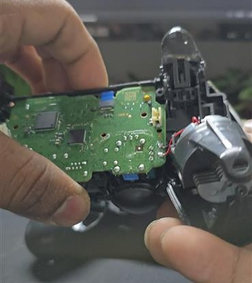
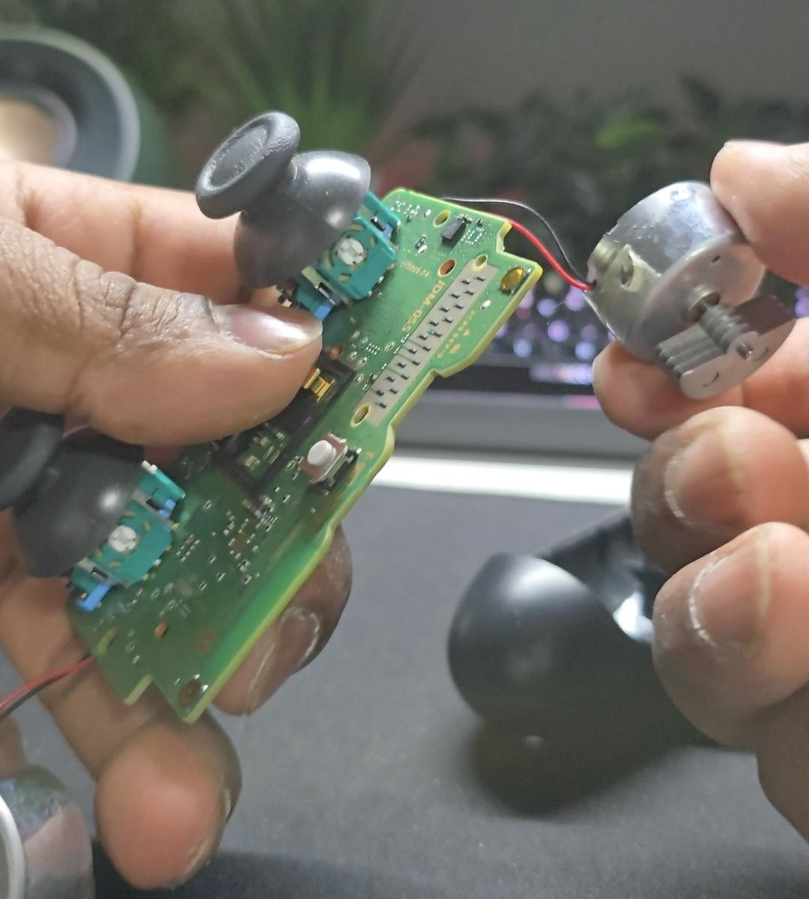

# FocusEnhancer
I was bored

***So i made a simple program that reads your keyboard and mouse input and vibrates the motors when you are not doing anything on your PC***
For the motors i just opened a PS4 Dualshock Controller (I had it laying around and didn't really need it anymore). I openend it up and removed the ***Shell***. 

**Components:**
