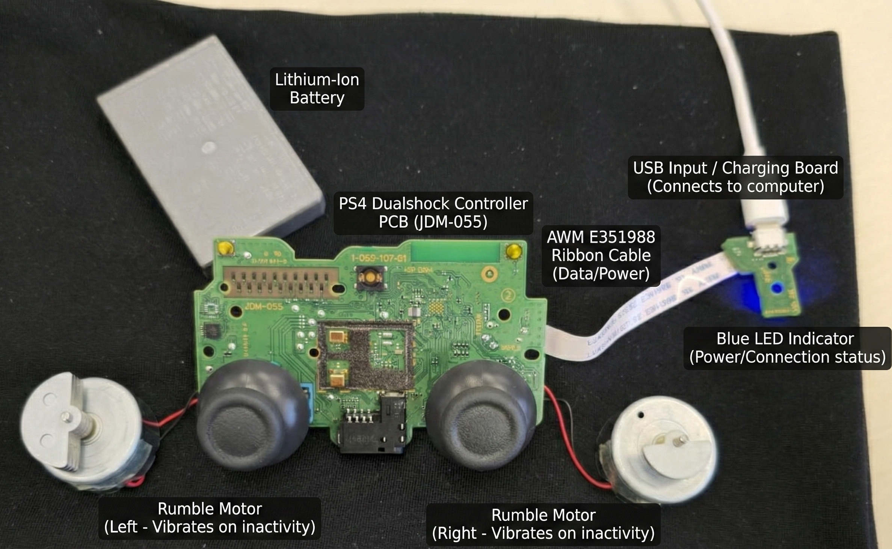

# FocusEnhancer
I was bored

### So i made a simple program that reads your keyboard and mouse input and vibrates the motors when you are not doing anything on your PC
For the motors i just opened a PS4 Dualshock Controller (I had it laying around and didn't really need it anymore). I openend it up and removed the **Shell**. 

## Components:

I used the pynput and the pygame classes in Python. 

**Pygame**: [A simple graphical joystick test application](https://www.pygame.org/project-pygame-joystick-1861-.html)
For the Joystick initialization and motor movement control.

**Pynput**: [This library allows you to control and monitor input devices](https://pypi.org/project/pynput/)
For the mouse and keyboard input recognition.

